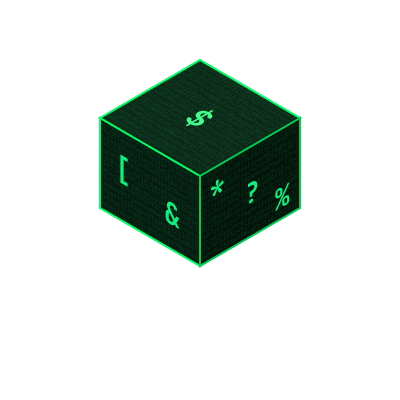

<h1 align="center">CharGen</h1>

<p align="center">
  
</p>


<p align="center">
  <em>Generate random characters from the character sets you choose — fast rand() or crypto-secure getrandom().</em>
</p>

<p align="center">
  <a href="https://github.com/vct-mrt/CharGen/actions/workflows/ci-cd.yml"></a>
  <a href="https://www.gnu.org/licenses/gpl-3.0"></a>
  <a href="https://github.com/vct-mrt/CharGen/releases"></a>
  
</p>

---

`CharGen` is a small command-line utility written in C that generates random
characters from selectable character sets — numeric, alphabetic, and special.
Handy for passwords, test fixtures, tokens, or random strings in general.
Linux-only, no dependencies beyond libc, a single binary of about 400 lines
across six source files.

By default it draws from the standard C `rand()` PRNG (fast, unbiased via
rejection sampling, but **not** for secrets). Pass `--secure` and it switches to
a cryptographically secure source: `getrandom()` with a `/dev/urandom`
fallback.

## Quick start

```bash
chargen 16                # 16 chars from all sets   -> aB3$xY9!mK2@pL8%
chargen -n 8              # 8 numeric chars          -> 42819537
chargen -ncs 20 --secure  # 20 chars, crypto-secure  -> 7hQ!p2$Rk9#tW4mZ*eL
```

## Installation

### Debian / Ubuntu (apt)

```bash
sudo install -d -m 0755 /etc/apt/keyrings
curl -fsSL https://vct-mrt.github.io/CharGen/apt/KEY.gpg | sudo tee /etc/apt/keyrings/chargen.gpg >/dev/null
echo 'deb [signed-by=/etc/apt/keyrings/chargen.gpg] https://vct-mrt.github.io/CharGen/apt stable main' | sudo tee /etc/apt/sources.list.d/chargen.list
sudo apt update && sudo apt install chargen
```

### Fedora / RHEL (dnf)

```bash
sudo dnf config-manager --add-repo https://vct-mrt.github.io/CharGen/rpm/chargen.repo
sudo dnf install chargen
```

The apt and dnf packages come from self-hosted, GPG-signed repositories
published to GitHub Pages. See [docs/REPOSITORY.md](docs/REPOSITORY.md) for
repository details.

### Snap

```bash
sudo snap install chargen
```

See [docs/SNAP.md](docs/SNAP.md) for the Snap package.

### Arch (PKGBUILD)

```bash
git clone https://github.com/vct-mrt/CharGen.git
cd CharGen/packaging
makepkg -si
```

### Build from source

```bash
git clone https://github.com/vct-mrt/CharGen.git
cd CharGen
make
sudo make install
```

`make install` respects `PREFIX` (default `/usr/local`) and `DESTDIR`, and
installs the binary plus the `chargen.1` man page.

## Usage

```bash
chargen [options] <number>
```

| Flag | Meaning |
| --- | --- |
| `-h`, `--help` | Display help, exit 0 |
| `-v`, `--version` | Display version, exit 0 |
| `-n` | Numeric characters only (0-9) |
| `-c` | Alphabetic characters only (both cases unless `-i`/`-a`) |
| `-s` | Special characters only |
| `-i` | Use lowercase (requires `-c`) |
| `-a` | Use uppercase (requires `-c`) |
| `--secure` | Use `getrandom()` / `/dev/urandom` instead of `rand()` |
| `<number>` | Count of characters to generate (required, positive integer) |

Short flags combine: `-ci` is lowercase letters only, `-ncs` is numbers plus
letters plus special. If none of `-n`/`-c`/`-s` is given, CharGen uses all four
character sets. Bad input (unknown flags, a missing/non-numeric/non-positive
count, `-i`/`-a` without `-c`) is rejected with exit status `84`; success exits
`0`.

## Examples

```bash
chargen 16                # 16 chars, default: all sets
chargen -n 8              # 8 numeric characters
chargen -ci 12            # 12 lowercase letters
chargen -s 10             # 10 special characters
chargen -ncs 20           # 20 chars: numbers + letters + special
chargen -ncs 20 --secure  # same, from a cryptographically secure RNG
```

## Security

The default mode uses the standard C `rand()` function with unbiased rejection
sampling. It is fine for general purposes — test data, random strings — but is
**not** cryptographically secure and must not be used for secrets.

For security-critical output, pass `--secure`. CharGen then sources randomness
from `getrandom()` with a `/dev/urandom` fallback (retrying on `EINTR`), which
is suitable for passwords and tokens. If no secure source is available it exits
`84` rather than falling back to `rand()`. If you prefer dedicated tools,
`pwgen` and `openssl rand` remain good alternatives.

## Building & testing

```bash
make               # standard build: gcc -o chargen src/*.c -I include -W -Wall -Wextra -O2
make debug         # build with debug symbols (-g3 -DDEBUG)
make re            # clean + rebuild
make check         # build, then run the test suite (tests/test.sh)
make clean         # remove build artifacts
sudo make install  # install to $PREFIX/bin (default /usr/local/bin) + man page
make uninstall     # remove installed files
```

The vector source for the logo lives at [`img/logo.svg`](img/logo.svg); the
rendered [`img/logo.png`](img/logo.png) is used above.

## Contributing

See [CONTRIBUTING.md](CONTRIBUTING.md) for the dev setup, coding style, and PR
process. For packaging and repository internals, see
[docs/REPOSITORY.md](docs/REPOSITORY.md) and [docs/SNAP.md](docs/SNAP.md).

## License

Licensed under the GNU General Public License v3.0. See the [LICENSE](LICENSE)
file for details.

## Author

**vct-mrt** — [GitHub](https://github.com/vct-mrt)
